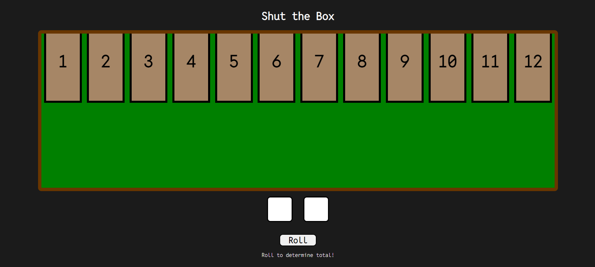

# ShutTheBox
ShutTheBox game written in ReactJS

## How game works
- ShutTheBox is a game based on chance and trying to fill in the tiles on the board by rolling 2 sets of dice
- To begin, click the 'Roll' button to begin the game and determine initial values.
- The goal of the game is to color in (or fill) all the tiles on the board by rolling 2 sets of dice.
- If you roll a value thats already been filled in, you lose
- If you complete the whole board and fill in all the tiles, you win.
- Have fun!

## To run
1. Clone repo to your system
2. From root of folder, run `npm i` to install dependencies 
    -   You may also optionally run `npm run build` afterwards to create production build of application

3. Once complete, run `npm start` to run the application 